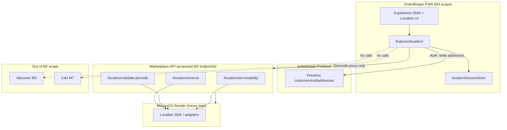
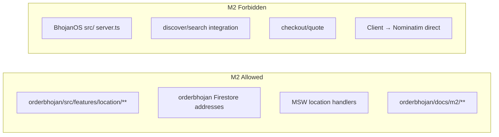
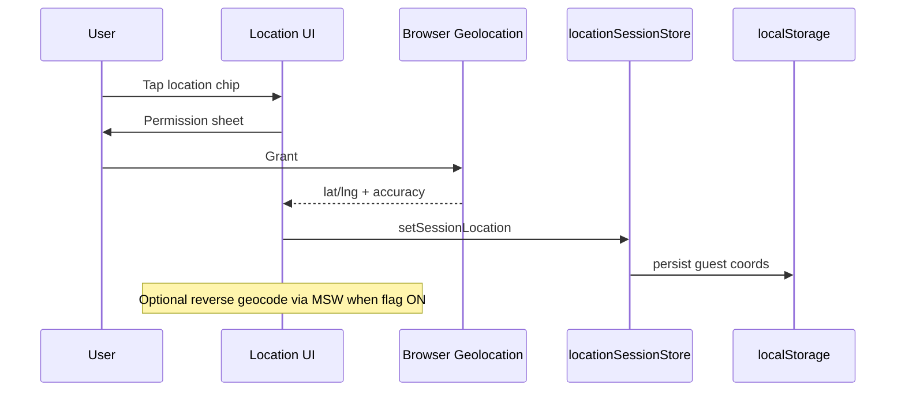
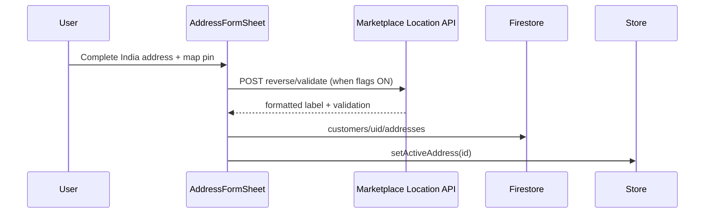

# M2 Architecture Report — Location Intelligence Platform

**Milestone:** M2  
**Status:** ARB Approved (Planning)  
**Author:** Architecture Review Board  
**Date:** 2026-06-26  
**Implementation:** NOT STARTED

---

## Executive Summary

M2 adds an OrderBhojan **client-side Location Intelligence layer** that captures GPS permission, India structured addresses, and session context — persisting saved addresses to `orderbhojan` Firestore and delegating geocoding/serviceability to **proposed Marketplace API endpoints**. The module integrates with the M1.6 experience shell header without enabling discovery, cart, or checkout. BhojanOS Location SDK (`docs/m2/`) remains backend-internal; OrderBhojan never imports BhojanOS SDKs.

---

## System Context



---

## Boundary Compliance



| Check | Status |
|-------|--------|
| No BhojanOS `src/` changes | ✓ Planned |
| No OpenAPI implementation in planning | ✓ Contracts doc only |
| No custom BDS forks | ✓ BDS AddressInput + sheets |
| OrderBhojan Firestore only for addresses | ✓ |
| Geocode via Marketplace API | ✓ ADR-OB-004 |
| Feature flags OFF by default | ✓ |

---

## Module Layout (Proposed — not implemented)

```
orderbhojan/src/features/location/
├── domain/
│   ├── location.types.ts       # CustomerLocation, SavedAddress, IndiaAddress
│   ├── location.schema.ts      # Zod validation
│   └── location.errors.ts      # Typed error codes
├── application/
│   ├── locationService.ts      # Orchestration
│   ├── geolocationService.ts   # Browser API wrapper
│   └── addressService.ts       # CRUD + default address
├── infrastructure/
│   ├── firestoreAddressRepo.ts
│   ├── marketplaceLocationClient.ts  # API calls only
│   └── localSessionLocation.ts       # Guest localStorage
├── store/
│   └── locationSessionStore.ts       # Active lat/lng/label
├── hooks/
│   ├── useGeolocation.ts
│   ├── useSavedAddresses.ts
│   ├── useActiveLocation.ts
│   └── useReverseGeocode.ts
├── ui/
│   ├── LocationPermissionSheet.tsx
│   ├── LocationChip.tsx              # Header chip
│   ├── AddressFormSheet.tsx
│   ├── AddressListSheet.tsx
│   ├── MapPinPicker.tsx              # Lazy MapLibre
│   └── LocationEmptyStates.tsx
└── index.ts
```

**Owner agent:** 07 Location Platform  
**UI integration points:** 05 OrderBhojan UI (`MarketplaceLayout` header slot only — coordinated handoff)

---

## Layer Responsibilities

| Layer | Responsibility | Must NOT |
|-------|----------------|----------|
| `domain/` | Types, validation, India address rules | Import React/Firebase |
| `application/` | Permission flow, address CRUD orchestration | Call discover/search |
| `infrastructure/` | Firestore, Marketplace client, localStorage | Direct geocoder HTTP |
| `store/` | Active session location | Persist PII unencrypted beyond spec |
| `hooks/` | React bindings | Business logic duplication |
| `ui/` | BDS-only presentation | Custom form primitives |

---

## Data Flow

### Flow 1 — First visit (guest)



### Flow 2 — Save address (authenticated)



### Flow 3 — Future M3 handoff (design only)

M3 Discovery reads `useActiveLocation()` → `{ lat, lng, label? }` → `GET /discover?lat=&lng=`. **No M2 call to discover.**

---

## Integration with M1.6 Experience Shell

| Surface | M2 change |
|---------|-----------|
| Header / location chip | Show active location label or "Set location" |
| Home skeleton rails | Unchanged — still skeleton until M3 |
| Bottom nav | Unchanged |
| Profile | Link to "Saved addresses" for auth users |
| Guest profile | CTA to sign in to save addresses |

---

## Firebase Data Model

```
customers/{uid}/addresses/{addressId}
  id: string
  label: 'home' | 'work' | 'other' | string
  isDefault: boolean
  address: IndiaAddress (see DOMAIN-MODEL.md)
  createdAt, updatedAt
```

Rules: **already deployed** in M1 — owner-only read/write.

Guest: **no Firestore** — `localStorage` key `ob_guest_location_v1` with `{ lat, lng, label?, capturedAt }`.

---

## Marketplace API Dependency

Proposed endpoints documented in [API-CONTRACTS-M2.md](./API-CONTRACTS-M2.md). M2 client uses MSW until BhojanOS Marketplace layer implements proxy to Location SDK.

**ADR:** [ADR-OB-004-location-intelligence-boundary.md](../adr/ADR-OB-004-location-intelligence-boundary.md)

---

## Feature Flags

| Flag | Scope |
|------|-------|
| `FF_LOCATION_ENABLED` | Module mount + location chip |
| `FF_LOCATION_MAP_ENABLED` | MapPinPicker lazy chunk |
| `FF_LOCATION_GEOCODE_API` | marketplaceLocationClient calls |

All default **OFF**. `gate:m2` verifies OFF state matches M1.6 regression.

---

## Performance Considerations

| Concern | Mitigation |
|---------|------------|
| MapLibre bundle | Dynamic import; separate chunk; flag OFF = no load |
| Reference data JSON | Lazy load by state; static import cap in bundle budget |
| Geolocation watch | One-shot getCurrentPosition; no continuous watch in M2 |
| Bundle budget | M2 increment ≤ 200 KB gzip (MapLibre lazy — not in initial path) |

---

## Security Considerations

- No coordinates in production logs (Telemetry agent consult)
- Geocode queries sanitized server-side
- Address PII only in orderbhojan Firestore — never BhojanOS client
- Guest localStorage — no phone/name stored in location blob

---

## ADRs

| ADR | Status |
|-----|--------|
| ADR-OB-001 Marketplace boundary | Accepted — M2 compliant |
| ADR-OB-004 Location intelligence boundary | Proposed — this milestone |

---

## Rollback Strategy

Disable `FF_LOCATION_ENABLED` → M1.6 behavior restored. Firestore addresses remain but are unused. No migration required.

See [ROLLOUT-STRATEGY.md](./ROLLOUT-STRATEGY.md).

---

## Open Questions

| Question | Owner | Target |
|----------|-------|--------|
| MapLibre vs static pin-only MVP for M2 v1 | DRB | Before implementation |
| Backend location endpoints live vs MSW-only ship | ARB + Marketplace API | Sprint 1 implementation |
| Reference data: client bundle vs API fetch | ARB | ADR-OB-004 |

---

## ARB Sign-Off

| Reviewer | Date | Decision |
|----------|------|----------|
| ARB | 2026-06-26 | **GO** — Planning package approved. Implementation blocked pending separate approval. |

---

*References: BhojanOS `docs/m2/LOCATION-PLATFORM-ARCHITECTURE.md`, `docs/m2/INDIA-ADDRESS-MODEL.md`, `orderbhojan/docs/m1/ARCHITECTURE-REPORT.md`*
