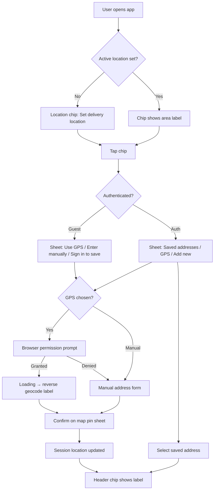

# M2 Design Review — Location UX

**Milestone:** M2 Location Intelligence Platform  
**Reviewer:** Design Review Board + Experience Evolution  
**Status:** Approved (Planning)  
**Date:** 2026-06-26

---

## Design Intent

Location UX must feel **native to the M1.6 premium marketplace shell** — warm, food-first, trustworthy. Setting location is the first step toward "food near you," not a bureaucratic address form. Mana Inti Bojanam used implicit single-store context; OrderBhojan makes location **explicit but lightweight**.

**Emotion:** Confidence ("we deliver here"), speed (GPS first), control (map pin confirm).

---

## UX Flow Overview

---

## Key Screens (BDS Only)

| Screen | BDS Components | Notes |
|--------|----------------|-------|
| Location chip (header) | `Text`, `Icon`, chip styling via tokens | Part of M1.6 glass header; tap target ≥ 44px |
| Permission sheet | `BottomSheet`, `Button`, `Text` | Explain why location helps; Deny → manual path |
| Saved address list | `BottomSheet`, `Card`, `Badge` | Default badge; swipe/delete future |
| Address form | `AddressInput`, `Input`, `Select`, `Button` | India hierarchy dropdowns |
| Map pin picker | `BottomSheet` + lazy map container | Draggable pin; confirm CTA |
| Empty / error states | `EmptyState`, `Alert` | GPS unavailable, out of area (future serviceability) |

**No custom Button/Card/Input.**

---

## Responsive Behavior

| Breakpoint | Behavior |
|------------|----------|
| 375px mobile | Full-width sheets; map 40vh min height |
| 768px tablet | Centered sheet max-width 480px |
| 1024px+ | Same as tablet — location is mobile-first |

---

## Dark Mode

- MapLibre dark tile style when `theme=dark` (implementation detail for Motion/DevOps)
- Chip and sheets use `--bds-*` tokens — re-verify contrast on orange accent
- Pin marker uses BDS primary token

---

## States

| State | UX |
|-------|-----|
| Loading GPS | Skeleton chip + sheet spinner |
| Permission denied | Friendly copy; manual entry prominent; no blocking modal loop |
| GPS unavailable | Desktop / insecure context — skip to manual |
| Reverse geocode fail | Show coordinates rounded; allow manual label edit |
| No saved addresses (auth) | EmptyState + "Add address" CTA |
| Form validation error | Inline field errors; pin required message |

---

## Accessibility

- Permission sheet: focus trap in BottomSheet; ESC closes
- Form labels on all inputs; pin described for screen readers
- Map pin: alternative manual lat entry **not** in M2 — map required with text fallback "Adjust pin on map" aria-live updates
- `prefers-reduced-motion`: no map fly animations

Handoff to Agent 11 Accessibility at implementation.

---

## Motion Intent (Handoff to Agent 12)

| Interaction | Duration | Reduced motion |
|-------------|----------|----------------|
| Sheet open | 280ms ease-out | Instant |
| Chip label update | 150ms fade | Instant |
| Map pin drag | none on release | N/A |

---

## Mana Inti Lineage (Experience Evolution)

| Mana Inti pattern | M2 evolution |
|-------------------|--------------|
| Implicit store location | Explicit chip + user control |
| Single tenant context | Session location for future multi-restaurant discover |
| Warm photography hero | Location chip complements hero — doesn't compete |
| Telugu-English warmth | Copy: "Deliver to" / "Your area" — glossary aligned |

Score target at implementation: Mana Inti ↔ OrderBhojan location UX ≥ 85/100.

---

## BDS Gaps

| Gap | Resolution |
|-----|------------|
| Location chip component | Compose from BDS `Badge` + `Icon` — no new BDS component in M2 planning |
| Cascading India selects | BDS `Select` repeated — Design System consult if multi-select needed later |
| Map container | App-level lazy wrapper — not BDS core |

---

## Out of UX Scope (M2)

- Discovery rail content changes
- Restaurant cards with distance (M3 — uses location context)
- Checkout address picker
- Driver tracking map

---

## DRB Sign-Off

| Reviewer | Date | Decision |
|----------|------|----------|
| DRB | 2026-06-26 | **GO** — UX flow approved for planning |
| Experience Evolution | 2026-06-26 | **GO** — Lineage aligned |

---

*Template: `.cursor/templates/design-review.md`*
