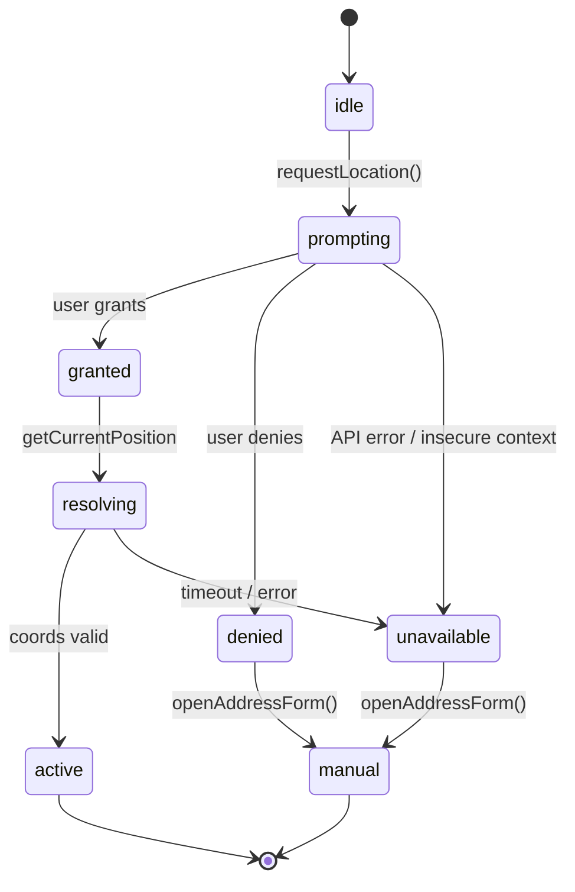
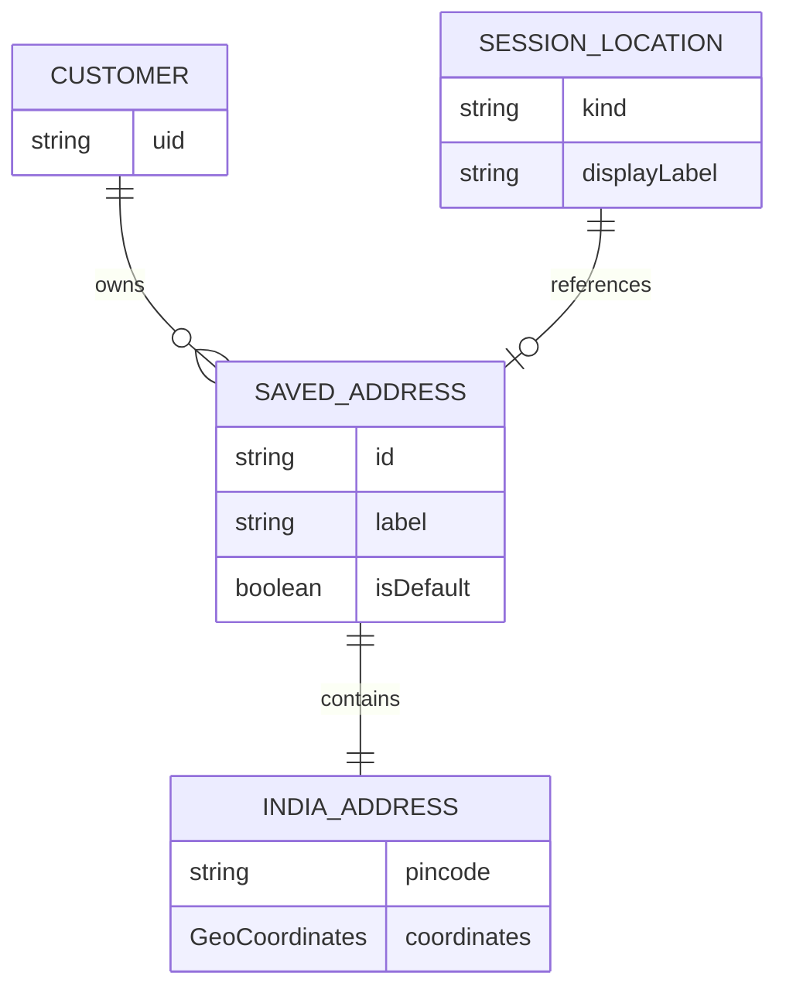

# M2 Domain Model — Location Intelligence

**Status:** Planning — no implementation  
**Aligns with:** `docs/m2/INDIA-ADDRESS-MODEL.md` (BhojanOS reference)

---

## Core Types

### GeoCoordinates

```typescript
interface GeoCoordinates {
  readonly lat: number;           // WGS84 -90..90
  readonly lng: number;           // WGS84 -180..180
  readonly accuracyM?: number;     // GPS accuracy when available
  readonly source: 'gps' | 'map_pin' | 'geocode' | 'manual';
  readonly capturedAt: string;     // ISO 8601
}
```

### IndiaAddress

Canonical structured address for India delivery. Field names match BhojanOS `IndiaAddress` for future Marketplace API parity.

```typescript
type CountryCode = 'IN';

interface IndiaAddress {
  readonly country: CountryCode;          // always 'IN'

  readonly stateCode: string;
  readonly stateName: string;

  readonly districtCode: string;
  readonly districtName: string;

  readonly cityCode: string;
  readonly cityName: string;

  readonly areaCode: string;
  readonly areaName: string;

  readonly pincode: string;                // 6 digits

  readonly street: string;
  readonly landmark?: string;

  readonly coordinates: GeoCoordinates;    // required — map pin
  readonly geohash?: string;               // precision 7 — computed client or server

  readonly formattedAddress?: string;      // display line
}
```

### SavedAddress

Firestore document in `customers/{uid}/addresses/{addressId}`.

```typescript
interface SavedAddress {
  readonly id: string;
  readonly label: AddressLabel;
  readonly customLabel?: string;           // when label === 'other'
  readonly isDefault: boolean;
  readonly address: IndiaAddress;
  readonly createdAt: string;
  readonly updatedAt: string;
}

type AddressLabel = 'home' | 'work' | 'other';
```

### CustomerLocation (Session)

Active location for marketplace session — guest or authenticated.

```typescript
interface CustomerLocation {
  readonly kind: 'session' | 'saved';
  readonly coordinates: GeoCoordinates;
  readonly displayLabel: string;           // e.g. "Koregaon Park" or "Home"
  readonly savedAddressId?: string;        // when kind === 'saved'
  readonly serviceability?: ServiceabilityHint;
}

interface ServiceabilityHint {
  readonly status: 'unknown' | 'serviceable' | 'unserviceable' | 'pending';
  readonly message?: string;               // customer-safe copy
  readonly checkedAt?: string;
}
```

### GuestLocationPersisted

LocalStorage schema — **no PII**.

```typescript
interface GuestLocationPersisted {
  readonly version: 1;
  readonly coordinates: GeoCoordinates;
  readonly displayLabel: string;
}
```

---

## Validation Rules (Zod — implementation)

| Field | Rule |
|-------|------|
| `pincode` | `/^[1-9][0-9]{5}$/` |
| `lat` | -90 to 90, not 0 when lng also 0 |
| `lng` | -180 to 180 |
| `street` | min 3 chars |
| `stateCode` | must exist in reference data |
| `districtCode` | must match selected state |
| `cityCode` | must match selected district |
| `areaCode` | must match selected city OR free-text fallback with warning (R-06) |

---

## State Machine — Permission



---

## Entity Relationships



---

## Reference Data (Client)

Static bundles — lazy loaded per state (aligns with BhojanOS M2 reference data platform):

```
orderbhojan/src/features/location/data/india/
├── states.json
├── districts/{stateCode}.json
├── cities/{districtCode}.json
└── areas/{cityCode}.json
```

**Owner:** Location Platform agent · **Reviewer:** ARB (bundle size)

---

## Error Codes (Domain)

| Code | Meaning | UX |
|------|---------|-----|
| `LOCATION_PERMISSION_DENIED` | User denied GPS | Manual entry |
| `LOCATION_UNAVAILABLE` | Browser unsupported | Manual entry |
| `LOCATION_TIMEOUT` | GPS timeout | Retry or manual |
| `ADDRESS_VALIDATION_FAILED` | Zod fail | Inline errors |
| `GEOCODE_FAILED` | API error | Coords + edit label |
| `PINCODE_INVALID` | Not in reference | Warning, allow override flag |

---

## Mapping to Marketplace API

| Domain | API field |
|--------|-----------|
| `IndiaAddress.coordinates` | `deliveryAddress.lat/lng` in quote (M8) |
| `CustomerLocation` | `lat`, `lng` query params on discover (M3) |
| `geohash` | Internal server — optional client compute |

---

*Owner agent: 07 Location Platform*
