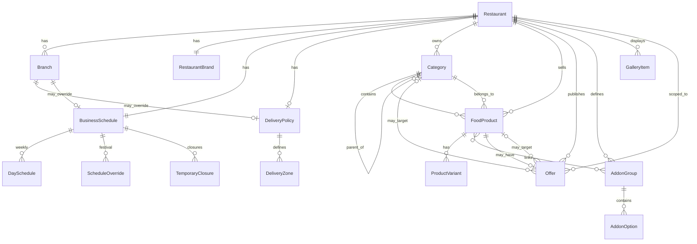

# 02 — Entity Relationship Model

High-level ERM for BhojanOS Product Domain. Identifiers are domain IDs unless noted.

---

## Diagram (conceptual)



---

## Entity catalog

| Entity | Type | Parent aggregate |
|---|---|---|
| Restaurant | Aggregate root | — |
| Branch | Entity | Restaurant |
| RestaurantBrand | Value object / entity | Restaurant |
| BusinessSchedule | Aggregate root | Restaurant (1:1) |
| DeliveryPolicy | Aggregate root | Restaurant (1:1) |
| DeliveryZone | Entity | DeliveryPolicy |
| Category | Aggregate root | Restaurant |
| FoodProduct | Aggregate root | Restaurant |
| ProductVariant | Entity | FoodProduct |
| AddonGroup | Aggregate root | Restaurant |
| AddonOption | Entity | AddonGroup |
| Offer | Aggregate root | Restaurant |
| GalleryItem | Entity | Restaurant |
| MarketingHighlight | Entity | Restaurant |
| MediaAsset | Value object | Various |
| RatingSummary | Read model | External (Reviews) |

---

## Cardinality rules

| Relationship | Cardinality | Rule |
|---|---|---|
| Restaurant → Branch | 1..* | Min 1 branch at publish |
| Restaurant → FoodProduct | 0..* | Zero allowed in draft |
| Restaurant → Category | 1..* | Min 1 category at publish |
| Category → Category (parent) | 0..1 | Max depth 2 |
| Category → FoodProduct | 0..* | Products on leaf only |
| FoodProduct → ProductVariant | 0..* | If hasVariants, min 1 |
| FoodProduct → AddonGroup | 0..* | M:N via reference list |
| AddonGroup → AddonOption | 1..* | Min 1 option per group |
| Restaurant → Offer | 0..* | Zero offers valid |
| Offer → FoodProduct | 0..1 | When scope = product |
| Offer → Category | 0..1 | When scope = category |
| FoodProduct → Offer | 0..1 | Product-scoped active offer |

---

## Reference vs composition

| Pattern | Example | Rationale |
|---|---|---|
| **Composition** | FoodProduct contains ProductVariant | Same lifecycle |
| **Reference** | FoodProduct → AddonGroup | Groups reused across products |
| **Reference** | FoodProduct → Category | Category managed independently |
| **Reference** | Restaurant → Offer | Offers managed in promotions module |
| **Read model** | Restaurant → RatingSummary | Reviews domain owns writes |

---

## Identity map

| Domain ID | Exposed to consumer? | Example |
|---|---|---|
| `RestaurantId` | Never | internal UUID |
| `PublicRestaurantId` | Yes | `obr_8f3k2...` |
| `Slug` | Yes (URL) | `mana-inti-kitchen` |
| `FoodProductId` | Never | internal |
| `PublicFoodId` | Yes | `obf_9x2m...` |
| `CategoryId` | Yes (opaque) | `obc_...` |
| `OfferId` | Never | internal |
| `BranchId` | Never (v1) | Future: pickup branch picker |

---

## Cross-domain boundaries (external)

| External domain | Interface to Product Domain |
|---|---|
| **Reviews** | Provides `RatingSummary` read model |
| **Orders** | References `FoodProductId`, `VariantId`, `AddonOptionId` snapshots |
| **Checkout / Coupons** | Separate from marketplace `Offer` display |
| **Analytics** | Writes `analyticsMetadata`; read-only in owner |
| **Identity / Users** | Owner `userId` owns restaurants via ACL |
| **Platform Discovery** | Reads projection indexes; does not own restaurant data |

---

## Product graph (consumer menu view)

```
Restaurant
  └── Category[] (ordered)
        └── FoodProduct[] (ordered)
              ├── ProductVariant[] (optional)
              ├── AddonGroup[] (resolved refs)
              ├── ProductOffer? (resolved)
              └── Media, Labels, Preparation, Story
```

Consumer never sees AddonGroup definitions without product context.
